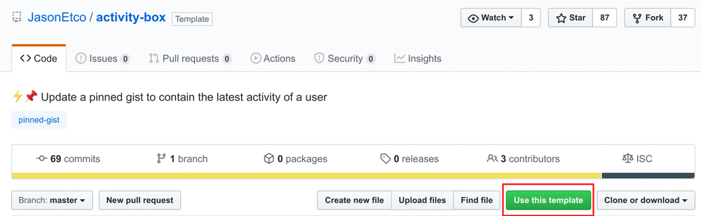
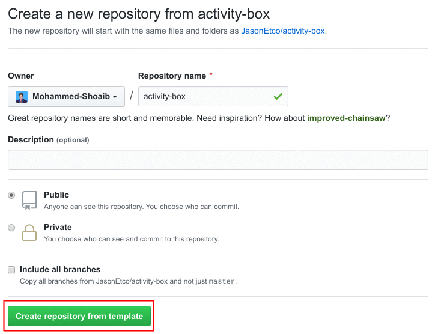

<p align="center">
  <h3 align="center">GitHub Log</h3>
  <p align="center">⚡️📌 Update a pinned gist to contain the latest activity of a user</p>
</p>

---

## Setup

**activity-box** is a GitHub Action that is designed to work using the [`schedule`](https://developer.github.com/actions/managing-workflows/creating-and-cancelling-a-workflow/#scheduling-a-workflow) event.

### Prep work

1. Create a new public GitHub Gist (https://gist.github.com/)
2. [Create a token](https://github.com/settings/tokens/new) with the `gist` scope and copy it. The `GITHUB_TOKEN` that comes with GitHub Actions cannot currently use the Gist API.

### Project setup

1. [Create a template repository](https://help.github.com/en/github/creating-cloning-and-archiving-repositories/creating-a-repository-from-a-template) by clicking [here](https://github.com/JasonEtco/activity-box/generate). Alternatively, you can click the _Use this template_ button:

|  |
| --- |

Name your repository and click _Create repository from template_.

|  |
| --- |

2. Create a `.github/workflows/activity-box.yml` file with a workflow like this:

```yml
name: Activity Box

on:
  schedule:
    - cron: '*/10 * * * *'

jobs:
  build:
    runs-on: ubuntu-latest

    steps:
      - uses: actions/checkout@v1
      - uses: JasonEtco/activity-box@master
        env:
          GH_PAT: ${{ secrets.GH_PAT }}
          GITHUB_TOKEN: ${{ secrets.GITHUB_TOKEN }}
          GH_USERNAME: JasonEtco
          GIST_ID: 123abc
```

3. [Create a secret](https://help.github.com/en/actions/configuring-and-managing-workflows/creating-and-storing-encrypted-secrets) 🔑 by going to **GitHub repo > Settings > Secrets > New secret** with the following:
- Name: `GH_PAT`.
- Value: The token with the `gist` scope generated previously.

4. 💰 Profit

### Environment variables & secrets

- **GIST_ID:** The ID portion from your gist url `https://gist.github.com/matchai/`**`6d5f84419863089a167387da62dd7081`**.
- **GH_PAT:** The GitHub token generated above.
- **GH_USERNAME:** The username handle of the GitHub account.

---

_Inspired by [matchai/bird-box](https://github.com/matchai/bird-box)_
